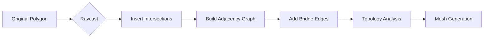

# Unity 2D Complex Polygon Slicer


A high-performance **2D physics cutting framework** based on native Unity APIs.

It supports arbitrary cutting of **concave polygons** and **polygons with holes** (e.g., donuts, grids), implementing correct topology reconstruction and texture (UV) mapping without relying on external libraries like *ClipperLib* or *Poly2Tri*.

> **Core Philosophy:** Implemented entirely based on **Graph Theory** and **Computational Geometry** algorithms, making it lightweight, modify-friendly, and highly optimized.

---

## ✨ Features

* **✂️ Arbitrary Shape Cutting**
    Supports cutting convex polygons, concave polygons, and complex polygons with holes.
* **🔄 Topology Reconstruction**
    Based on graph traversal algorithms, automatically handles complex topological changes such as *"one cut resulting in multiple fragments"* or *"cutting through a ring"*.
* **🕳️ Hole Handling**
    Intelligently identifies the hierarchy between solids and holes, supporting nested structures (e.g., islands inside a large hole).
* **🎨 Seamless Texturing**
    Uses a UV interpolation algorithm based on the original bounding box to ensure textures do not misalign or stretch after cutting.
* **⚛️ Physics Inheritance**
    Cut fragments automatically inherit the `velocity`, `angular velocity`, and `physics material` of the original object.
* **⚡ High Performance**
    * **Zero GC:** The core algorithm uses struct hashing and object pooling to avoid runtime memory allocation.
    * **Inlining Optimization:** High-frequency geometric calculations are accelerated using `[MethodImpl(AggressiveInlining)]`.

---

## 🚀 Getting Started

### 1. Prepare a Sliceable Object
You don't need to manually create complex Meshes; just a single image is enough.

1.  Drag an image (**Sprite**) into the scene.
2.  Attach the `SliceableGenerator` script to it.
3.  Click the menu icon (or right-click) on the script component and select **"Generate Sliceable Mesh"**.
4.  *Result:* The system automatically generates the Mesh, `PolygonCollider2D`, and `Rigidbody2D`, and records original UV data.

### 2. Configure the Cutter
1.  Create an empty GameObject in the scene and attach the `MouseSlicer` script.
2.  Configure the **Sliceable Layer** to ensure it can detect your target object's layer.
3.  **Run the game**, hold the left mouse button, and swipe across the object to cut it.

---

## 🧠 Algorithm Breakdown

This project abandons the traditional *"Left-Right Vertex Classification"* method and adopts a more general **Graph Theory Reconstruction** approach.

### Workflow Visualization


### Key Steps

1.  **Geometry Deconstruction**
    The cutting line is treated as a "double-edged sword" inserted into the topological structure. The system breaks original edges at intersections and adds bidirectional "cut seams" inside the object based on the Odd-Even Rule.

2.  **Topology Reconstruction (Left-Most Turn)**
    The algorithm traverses the graph to extract all closed loops:
    * **Counter-Clockwise Loop (CCW):** Identified as Solid.
    * **Clockwise Loop (CW):** Identified as Hole.

3.  **Hierarchy Restoration**
    Reconstructs the "Solid-Hole" parent-child relationship through geometric containment tests. Invalid geometries (e.g., a hole not belonging to any solid) are discarded (fixing the classic "Hole becomes Solid" bug).

4.  **Visual Restoration**
    * **Bridge Building:** Stitches holes to the outer contour, converting them into a simply connected polygon.
    * **Ear Clipping:** Triangulates the polygon to generate the final Mesh.

---

## 📂 File Structure

```text
Scripts/
├── Slicer.cs                # Core Algorithm Library (Math & Graph construction)
├── SliceableGenerator.cs    # Automation Tool (Sprite -> Physics Entity)
├── Triangulator.cs          # Ear Clipping implementation
├── PolygonHoleMerger.cs     # Geometry Stitcher (Holes -> Simple Polygon)
└── MouseSlicer.cs           # Input Controller (Raycasting)
```

---

## 🛠️ FAQ

**Q: Why does the texture change after cutting?**
> **A:** Ensure the object has the `SliceableGenerator` component attached. It records the bounding box information of the original image to calculate correct relative UVs.

**Q: What if the cutting line is too short to cut through?**
> **A:** `Slicer` automatically dynamically extends the cutting line internally to ensure it penetrates the object's bounding box. You only need to ensure the mouse swipe direction covers the object.

**Q: Are 3D objects supported?**
> **A:** Currently, only **2D (XY plane)** is supported. However, the core algorithm logic (graph reconstruction) is applicable to cross-section calculations for 3D meshes.

---

## 🤝 Contribution & Support

If you find a Bug or have suggestions for performance optimization, feel free to submit an Issue or Pull Request.


---

## 🇨🇳 中文简介 (Chinese Summary)

这是一个基于 Unity 原生 API 开发的高性能 **2D 物理切割系统**。与传统的简单切割插件不同，本项目完全基于**图论和计算几何算法**重写，不依赖任何第三方的大型数学库。

### 主要特点

* **真正的任意切割**：无论是凹多边形、还是像“回”字、“田”字这样带孔的复杂形状，都能完美切割，不会出现图形错误或贴图拉伸。
* **智能拓扑重组**：算法能自动处理复杂的拓扑变化（比如切断一个圆环变成C形，或者一刀切出三个碎片）。
* **无缝纹理支持**：内置 UV 修正逻辑，切开后的碎片纹理依然保持原样，不会错位。
* **高性能优化**：核心代码经过深度优化，适合在移动端运行。
* **开箱即用**：提供一键转换脚本，把普通的 Sprite 图片拖进去就能变成可以切的物理实体。
