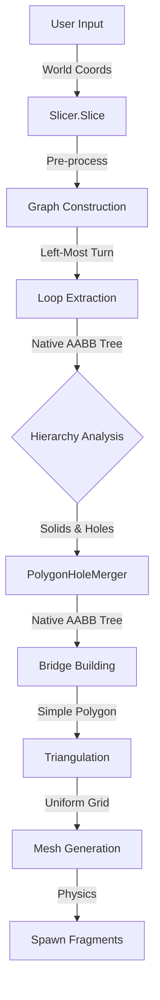

# Unity 2D Physics Slicer


A lightweight, high-performance **2D physics cutting library** for Unity. 
It implements a robust pipeline for slicing sprites into physics-based fragments with correct texture mapping and collision handling.

> **Design Goal:** To provide a fast, dependency-free cutting solution suitable for mobile games and projects requiring frequent mesh generation.

---

## ✨ Features

* **⚡ Optimized Performance:**
    * Algorithms (Triangulation, Hole Merging) are optimized to approach **O(N)** complexity.
    * Uses **Uniform Grid** spatial hashing to accelerate ear-clipping.
    * Implements a custom **AABB Tree** to speed up fragment hierarchy analysis.
* **🛠️ Practical Topology Handling:**
    * Supports concave polygons and polygons with holes.
    * **Bridge Building:** Automatically stitches holes to the outer contour for rendering.
    * **Odd-Even Rule:** Correctly separates multiple fragments from a single cut.
* **💾 Memory Friendly:**
    * heavily utilizes `Struct` and `In-Place` operations to minimize Garbage Collection (GC) during runtime.
* **🎨 UV Consistency:**
    * Maintains correct texture mapping for fragments using an original reference box system.

---

## 🚀 Getting Started

### 1. Setup a Sliceable Object
1.  Drag an image (**Sprite**) into the scene.
2.  Attach the `SliceableGenerator` script to it.
3.  Right-click the component title or use the context menu to select **""Generate Sliceable Mesh""**.
    * *This converts the Sprite into a Mesh with a PolygonCollider2D and records UV reference data.*

### 2. Slicing
1.  Create an empty GameObject and attach the `MouseSlicer` script.
2.  Set the **Sliceable Layer** to match your target object's layer.
3.  **Run**: Hold the left mouse button to draw a line across the object.

### 3. Scripting API
```csharp
// target: GameObject with PolygonCollider2D and MeshFilter
// start/end: Cutting line in World Space
Slicer.Slice(targetGameObject, worldStartPoint, worldEndPoint);
```

---

## ⚙️ Architecture & Workflow

### 📂 Project Structure
```text
Scripts/
├── Slicer.cs                # Core Logic (Topology & Graph Construction)
├── SliceableGenerator.cs    # Data Setup (Sprite -> Physics Entity & UV Reference)
├── Triangulator.cs          # Math Core (Grid-Accelerated Ear Clipping)
├── PolygonHoleMerger.cs     # Geometry Utility (Hole Stitching via Bridge Building)
├── NativeAABBTree.cs        # Acceleration Structure (Static Spatial Index)
└── MouseSlicer.cs           # Interaction (Input, Raycast & Visuals)
```

### 🔄 Execution Pipeline


### 🧩 Component Details

#### 1. Core Logic (`Slicer.cs`)
The main entry point. It handles the geometric heavy lifting:
* **Graph Construction:** Converts collider paths into a graph to identify intersections.
* **Loop Extraction:** Traverses the graph to find all closed loops (fragments and holes).
* **Hierarchy Analysis:** Uses a flattened AABB Tree (NativePolyTree) to efficiently parent holes to their containing solids.

#### 2. Mesh Processing (`Triangulator.cs` & `PolygonHoleMerger.cs`)
* **Hole Merging:** Uses a raycast-based ""Bridge Building"" algorithm to merge holes into the outer polygon, making it simply connected. It leverages `NativeAABBTree` for fast raycast queries.
* **Triangulation:** A custom Ear Clipping implementation optimized with a **Uniform Grid** and **Candidate List** to reduce search complexity.

#### 3. Utility (`SliceableGenerator.cs`)
A helper tool that bridges the gap between Unity Sprites and the Slicer system.
* Converts `SpriteRenderer` to `MeshRenderer` + `MeshFilter`.
* Records the **UV Reference Rect** to ensure texture continuity across fragments.

---

## ⚠️ Limitations

* **Complex Nesting:** While it handles basic holes (island in a hole), extremely complex nested structures (hole in island in hole...) may have edge cases.
* **Precision:** Relies on floating-point arithmetic. Extremely tiny fragments or almost-coincident vertices might be filtered out for stability.
* **2D Only:** Strictly for planar 2D geometry (XY plane).

---

## 🇨🇳 中文简介 (Chinese Summary)

这是一个轻量级、高性能的 **Unity 2D 物理切割库**。它旨在为移动端游戏或需要频繁切割的项目提供一个零依赖的解决方案。

### 主要特点

* **⚡ 性能优化**：通过**均匀网格 (Uniform Grid)** 和 **AABB 树** 加速核心几何算法，将三角剖分和层级分析的复杂度降至接近 **O(N)**。
* **🧠 拓扑处理**：支持凹多边形和带洞多边形。内置**搭桥算法**将孔洞缝合进网格，确保渲染正确。
* **💾 内存友好**：大量使用结构体和原地操作，核心热路径尽量避免 GC 分配。
* **🎨 纹理保持**：`SliceableGenerator` 会记录原始 UV 参照系，确保碎片纹理不会错位。

### 使用方法

1.  **转换**：给 Sprite 挂载 `SliceableGenerator`，点击 ""Generate Sliceable Mesh"" 将其转换为可切割的物理实体。
2.  **切割**：使用 `MouseSlicer` 或调用 `Slicer.Slice()` API 进行切割。

### 注意事项

* 本项目主要针对游戏开发中的常见切割需求（如切水果、破碎物体）。
* 对于极其复杂的几何结构（如多层嵌套孔洞）或极高精度的 CAD 级应用，建议评估其适用性。

---
