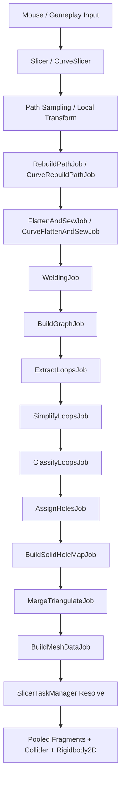

# Unity 2D Physics Slicer


A high-performance **Unity 2D arbitrary slicing project** focused on complex polygon cutting, hole handling, and async fragment generation.

This project has evolved from an early main-thread-oriented implementation into a **full Job System pipeline** covering topology rebuild, loop extraction, hole assignment, bridge merging, triangulation, mesh build, and async fragment resolve.

> **Design Goal:** Push the heavy geometric work into `Burst + Jobs + NativeContainer`, keep the main thread focused on Unity API boundaries, and make frequent 2D slicing viable in real gameplay scenarios.

---

## Features

* **High-performance slicing pipeline**
  * Full async pipeline based on `Unity Jobs + Burst`
  * Heavy geometry stages are offloaded from the main thread
  * `SliceContext` + Native containers are pooled and reused to reduce GC pressure

* **Robust topology handling**
  * Supports concave polygons
  * Supports polygons with holes
  * Supports line slicing and curve slicing
  * Supports closed-loop punching / bite-style slicing / complex loop reconstruction

* **Geometry processing stack**
  * Native graph rebuild from collider paths
  * Loop extraction and classification
  * Hole-to-solid parenting via `NativePolyTree`
  * Hole bridge merging via `PolygonHoleMerger`
  * Ear-clipping triangulation via `Triangulator`

* **Fragment runtime system**
  * Async fragment resolve through `SlicerTaskManager`
  * Pool-based fragment reuse to reduce repeated create/destroy spikes
  * Native data caching via `SliceableNativeData`
  * UV continuity preserved through reference-rect mapping

* **Physics-aware fragment output**
  * Fragment `mass / centerOfMass / inertia` are derived from geometry
  * Fragment generation path no longer depends on Unity auto-mass
  * Better stability for thin / irregular fragments than naive area-only mass assignment

---

## Getting Started

### 1. Setup a Sliceable Object
1. Drag a Sprite into the scene, or create a custom polygon test object.
2. Attach `SliceableGenerator` if you are starting from a Sprite.
3. Use **Generate Sliceable Mesh** to convert the Sprite into:
   * `MeshRenderer + MeshFilter`
   * `PolygonCollider2D`
   * UV reference data for later fragment generation

### 2. Slicing
1. Create an empty GameObject and attach `MouseSlicer`.
2. Set the correct **Sliceable Layer**.
3. Run the scene and slice using:
   * **Straight mode** for line slicing
   * **Curved mode** for freehand path slicing

### 3. Scripting API
```csharp
// target: GameObject with PolygonCollider2D and MeshFilter
// start/end: cut line in world space
Slicer.Slice(targetGameObject, worldStartPoint, worldEndPoint);
```

For curved slicing:
```csharp
// points: sampled world-space curve path
// isClosed: whether the path should be treated as a closed loop
CurveSlicer.CurveSlice(targetGameObject, points, isClosed);
```

---

## Architecture & Workflow

### Project Structure
```text
Assets/Scripts
├─ Core
│  ├─ SlicerCore.cs
│  ├─ SliceContext.cs
│  └─ SlicerTaskManager.cs
├─ Runtime
│  ├─ Slicer.cs
│  ├─ CurveSlicer.cs
│  └─ MouseSlicer.cs
├─ Jobs
│  ├─ SlicerJobs.cs
│  ├─ SlicerGraphJobs.cs
│  ├─ SlicerPostJobs.cs
│  └─ CurveSlicerCore.cs
├─ Geometry
│  ├─ PolygonHoleMerger.cs
│  ├─ Triangulator.cs
│  ├─ NativeAABBTree.cs
│  └─ NativePolyTree.cs
├─ Pooling
│  ├─ PooledSlicePiece.cs
│  ├─ SlicePiecePool.cs
│  ├─ SlicePieceFactory.cs
│  └─ SliceMeshArrayPool.cs
├─ Generation
│  ├─ SliceableGenerator.cs
│  ├─ CustomPolygon.cs
│  └─ CustomPolygonBatchSpawner.cs
├─ Data
│  └─ SliceableNativeData.cs
└─ Utils
   └─ SlicerMath.cs
```

### Execution Pipeline

```mermaid
graph TD
    Input[Mouse / Gameplay Input] --> Entry[Slicer / CurveSlicer]
    Entry --> Sample[Path Sampling / Local Transform]
    Sample --> Rebuild[RebuildPathJob / CurveRebuildPathJob]
    Rebuild --> Flatten[FlattenAndSewJob / CurveFlattenAndSewJob]
    Flatten --> Weld[WeldingJob]
    Weld --> Graph[BuildGraphJob]
    Graph --> Loops[ExtractLoopsJob]
    Loops --> Simplify[SimplifyLoopsJob]
    Simplify --> Classify[ClassifyLoopsJob]
    Classify --> Parent[AssignHolesJob]
    Parent --> Map[BuildSolidHoleMapJob]
    Map --> Merge[MergeTriangulateJob]
    Merge --> Mesh[BuildMeshDataJob]
    Mesh --> Resolve[SlicerTaskManager Resolve]
    Resolve --> Output[Pooled Fragments + Collider + Rigidbody2D]
```

### Project Flow Overview

From a runtime perspective, the project works roughly like this:

1. **Input & Path Sampling**
   * `MouseSlicer` collects line or curve input in world space.
   * `Slicer` / `CurveSlicer` convert the path into the target's local space and prepare slicing context.

2. **Native Geometry Rebuild**
   * Collider paths cached in `SliceableNativeData` are fed into the Job pipeline.
   * Edge rebuild, seam stitching, vertex welding, graph construction, and loop extraction all happen in native containers.

3. **Loop Analysis**
   * Extracted loops are simplified and classified into solids / holes.
   * Hole-parent relationships are assigned so each final fragment knows which holes belong to it.

4. **Bridge Merge & Triangulation**
   * Holes are merged into solids through bridge construction.
   * The resulting simple polygons are triangulated and written into `MeshData`.

5. **Async Resolve on Main Thread**
   * `SlicerTaskManager` completes finished jobs within a frame budget.
   * Meshes are applied, colliders are rebuilt, rigidbody data is restored, and fragment objects are spawned or reused from the pool.

6. **Fragment Runtime**
   * Generated fragments re-enter the runtime as new sliceable objects.
   * Their mesh, collider cache, UV reference, and physics data are ready for the next cut.

### Main Runtime Responsibilities

#### 1. Entry Layer
* `MouseSlicer`: input sampling, path collection, target detection
* `Slicer`: straight-line slicing entry
* `CurveSlicer`: polyline / closed-loop / punch / bite slicing entry

#### 2. Core Async Layer
* `SlicerTaskManager`: async task queue, frame-budgeted resolve, mesh application, fragment creation
* `SliceContext`: pooled native workspace for a full slicing task
* `SliceableNativeData`: persistent collider path cache used by jobs

#### 3. Geometry Layer
* `PolygonHoleMerger`: converts polygons-with-holes into simple polygons
* `Triangulator`: ear-clipping triangulation with acceleration structures
* `NativeAABBTree` / `NativePolyTree`: spatial acceleration and hierarchy queries

---

## Performance Notes

### Current Test Result

Under a stress scenario of:

* **100 sliceable objects**
* each object around **270 vertices**
* **physics collision disabled / not participating in heavy collision solve**

the current pipeline can maintain:

* **stable 60 FPS**
* **average FPS around 90-100**

This result reflects the strength of the current slicing pipeline itself:

* topology rebuild is stable
* async job stages scale well
* main-thread slicing logic is no longer the primary bottleneck in this test profile

### Important Bottleneck Observation

In heavy fragment scenarios, the dominant bottleneck is often **Unity's built-in 2D physics layer**, especially:

* fragment-vs-world collision solving
* fragment-vs-fragment collision solving
* high contact counts after large-scale slicing

In other words:

* **slicing algorithm cost** and
* **post-slice physics simulation cost**

must be evaluated separately.

This project currently performs very well on the geometry side, but physics-side cost can still dominate in gameplay depending on fragment density and collision rules.

---

## Practical Usage Advice

### 1. Tune fragment generation by gameplay

Do not treat fragment spawning strategy as fixed.

For real projects, you should adjust fragment output based on gameplay needs:

* reduce or suppress tiny fragments
* merge visually insignificant debris
* selectively disable rigidbodies on cosmetic pieces
* selectively disable fragment-vs-fragment collision
* delay or skip collider generation for unimportant pieces

Different gameplay genres should use different fragment policies:

* arcade slash gameplay
* puzzle destruction gameplay
* cinematic breakup effects
* sandbox physics slicing

should not share the exact same fragment spawning rules.

### 2. Pooling strategy should be project-specific

The current pooling logic is built to reduce repeated create/destroy spikes, but in production you may still need to tune it further for your own game:

* pool capacity
* despawn timing
* fragment lifetime policy
* whether inactive fragments keep rigidbody/collider state
* whether some fragment classes should bypass pooling entirely

### 3. Stress test geometry and physics separately

When profiling, test at least these cases separately:

* slicing only, minimal physics interaction
* slicing with world collision only
* slicing with fragment-vs-fragment collision enabled
* repeated slicing on already fragmented objects

This helps identify whether the bottleneck comes from:

* geometry pipeline
* object creation / resolve
* collider sync
* physics contact solving

---

## Limitations

* **Extreme geometry should be approached carefully**
  * This project is designed for high-performance gameplay slicing, not CAD-grade geometry processing.
  * Extremely complex polygons, highly pathological contours, or huge numbers of nested structures should be tested cautiously.

* **Triangulation algorithm may need future upgrade**
  * The current triangulation pipeline is optimized ear clipping.
  * For extremely complex geometry, highly fragmented shapes, or future larger-scale production workloads, upgrading the triangulation backend may be worth considering.

* **Physics can dominate runtime cost**
  * In dense fragment scenarios, Unity 2D physics can become the true bottleneck even when slicing itself remains fast.

* **Very small fragments require policy decisions**
  * Tiny fragments may still need gameplay-side filtering, suppression, or simplified handling for stability and performance.

* **2D only**
  * This project is strictly for planar 2D slicing on the XY plane.

---

## Chinese Summary

这是一个以 **Unity 2D 任意切割** 为目标、并且已经完成 **全流程 Job System 管线化** 的高性能项目。

它的核心思路不是简单地“切完以后立刻在主线程里重建物体”，而是将切割流程拆成：

* 输入采样
* 原生边重建
* 图拓扑恢复
* 环提取与分类
* 孔洞归属
* 搭桥合并
* 三角剖分
* `MeshData` 构建
* 主线程异步收尾与碎片生成

这样做的结果是，项目的核心几何计算已经大规模下沉到：

* `Burst`
* `Unity Jobs`
* `NativeArray / NativeList / NativeStream`

主线程更多只负责：

* Unity API 边界调用
* Mesh 应用
* Collider 回写
* 碎片对象生成与回收

### 当前阶段的性能结论

根据当前压力测试结果，在**关闭重物理碰撞开销**的条件下：

* **100 个物体**
* **每个物体约 270 顶点**

可以做到：

* **稳定 60 帧**
* **平均帧率约 90-100 帧**

这说明当前项目的**切割算法与 Job 化流水线本身已经相当稳定**。

### 项目流程简述

如果用一句话概括，这个项目的运行流程就是：

**输入采样 -> 原生几何重建 -> 图拓扑提环 -> 环分类与孔归属 -> 搭桥合并 -> 三角剖分 -> MeshData 构建 -> 主线程异步收尾 -> 碎片重新进入可切割流程**

更具体一点：

1. **输入层**
   * `MouseSlicer` 负责采样鼠标轨迹
   * `Slicer / CurveSlicer` 负责把世界坐标切割路径转成目标物体局部坐标，并发起任务

2. **原生 Job 管线**
   * 从 `SliceableNativeData` 缓存的 collider 路径出发
   * 在工作线程里完成边重建、缝合、焊点、建图、提环、简化、分类、孔洞归属

3. **几何后处理**
   * 对带孔碎片执行搭桥合并
   * 把最终简单多边形交给三角剖分器
   * 生成可直接写入 Unity Mesh 的 `MeshData`

4. **主线程收尾**
   * `SlicerTaskManager` 按帧预算收割已完成任务
   * 把 `MeshData` 应用到对象池碎片
   * 回写 `PolygonCollider2D`
   * 恢复 Rigidbody2D、UV 参考和切片缓存

5. **碎片回流**
   * 新生成的碎片会重新成为可继续切割的对象
   * 因此整个系统是一个可持续迭代的切割闭环，而不是一次性破碎流程

### 当前最重要的实际结论

在大量碎片场景下，真正需要重点关注的瓶颈已经不再只是切割算法，而是：

* Unity 自带 2D 物理层
* 碎片与场景之间的碰撞
* 碎片与碎片之间的碰撞

所以项目使用时需要特别注意：

* 按玩法调整碎片生成逻辑
* 针对项目需求优化对象池策略
* 对微小碎片做有意识的筛选、合并或降级处理

### 使用建议

这个项目非常适合：

* 游戏内高频 2D 切割
* 带孔图形切割
* 非规则碎裂效果
* 需要控制 GC 和主线程尖峰的运行时场景

但对于以下情况需要更谨慎：

* 极端复杂的几何图形
* 非常病态的轮廓结构
* 超大规模碎片同时参与物理模拟

在这些场景下，除了玩法层降级策略外，也可能需要考虑进一步升级底层的**三角剖分算法**。

---

## Status

Current status:

* full slicing pipeline has been jobified
* async fragment resolve is in place
* object pooling is integrated
* fragment physics properties are geometry-derived
* high-load stress testing has been carried out

Further optimization work is still gameplay-dependent, especially on the physics and fragment-policy side.
